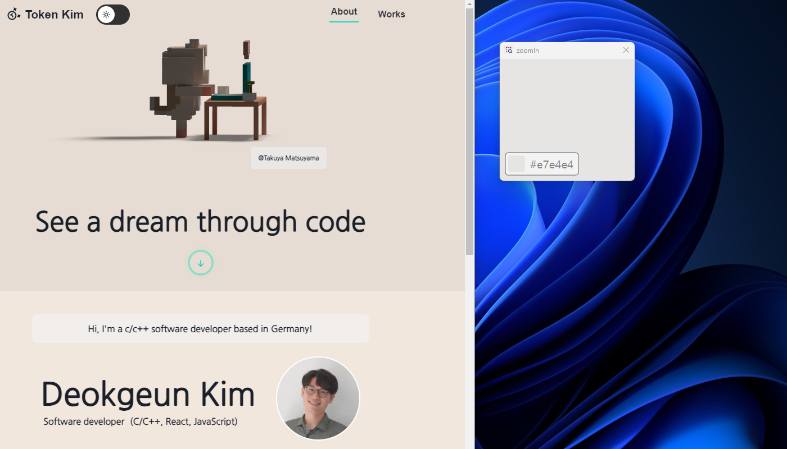
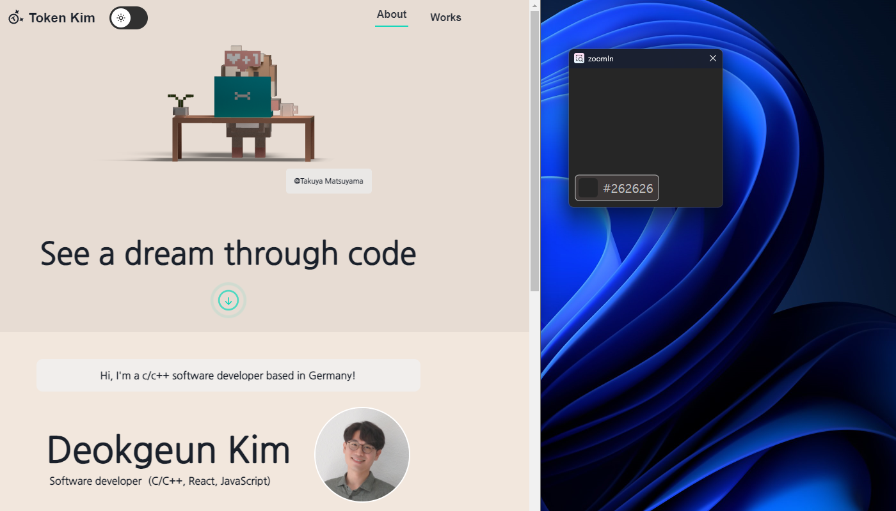
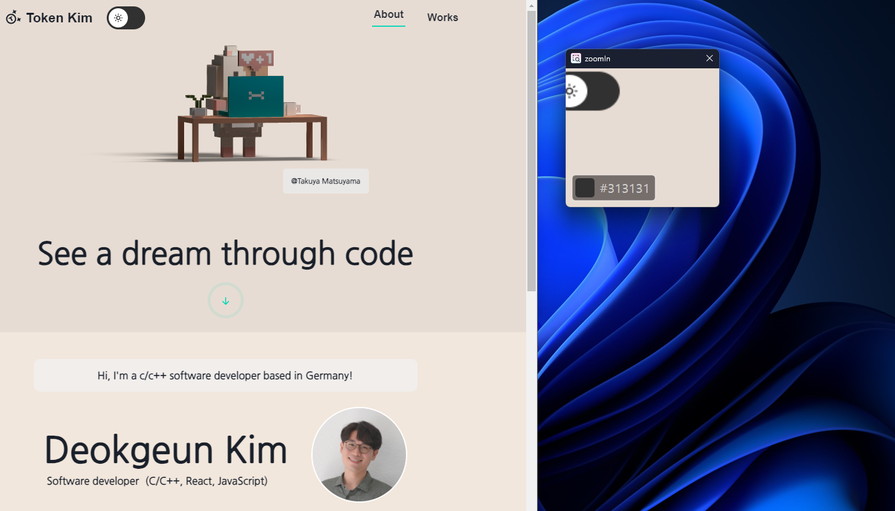
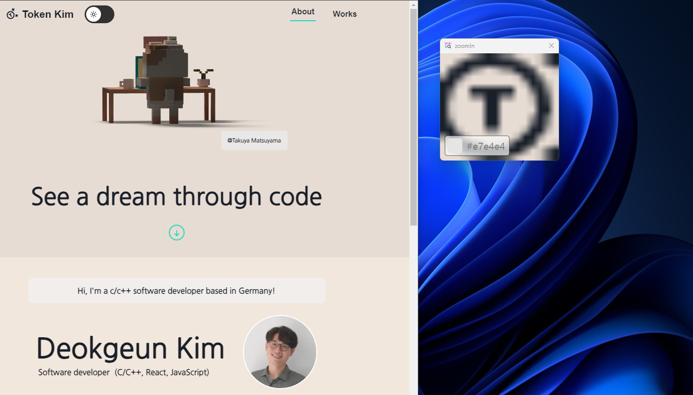

# zoomIn

A Program using C++ to zoom window and select pixel color.

It is useful for looking at the details of the little icons and choosing a color from them.

This Program was inspired by Programmer `Soungyub Kim`.

The website he runs is under this link: https://cafe.naver.com/mythread

## How to run

Even if there is no virus, man can't download the executable file on website, so you must download the project and build it yourself.

And run zoomIn.exe. That's it!

## How to use

If you hold down the `Shift key` and `move the mouse`, the position where the mouse is located is drawn larger.

And when you `click on a pixel` in the application, this pixel color value will appear in the button below. To copy this color value you should just `click the button`.

You can select the zoom size ratio via `the mouse wheel`.

## Used tools

- C++
- Win32 API (especially Direct2d)
- Visual Studio

## Overview

  
  
  
  
